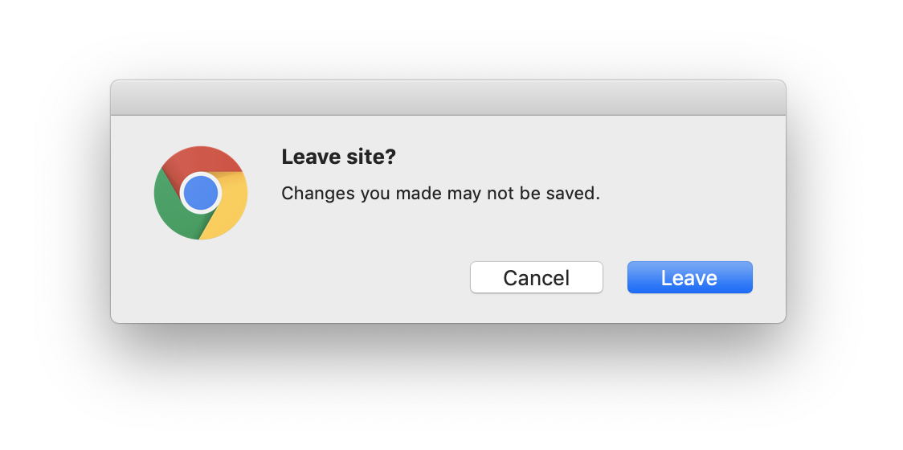

# Blocking Transitions

`history` lets you block navigation away from the current page using the
[`history.block(blocker: Blocker)`](api-reference.md#history.block) API. For
example, you can make sure the user knows that if they leave the current page
they will lose some unsaved changes they've made.

```js
// Block navigation and register a callback that
// fires when a navigation attempt is blocked.
let unblock = history.block(tx => {
  // Navigation was blocked! Let's show a confirmation dialog
  // so the user can decide if they actually want to navigate
  // away and discard changes they've made in the current page.
  let url = tx.location.pathname;
  if (window.confirm(`Are you sure you want to go to ${url}?`)) {
    // Unblock the navigation.
    unblock();

    // Retry the transition.
    tx.retry();
  }
});
```

This example uses
[`window.confirm`](https://developer.mozilla.org/en-US/docs/Web/API/Window/confirm),
but you could also use your own custom confirm dialog if you'd prefer.

## Caveats

`history.block` will call your callback for all in-page navigation attempts, but
for navigation that reloads the page (e.g. the refresh button or a link that
doesn't use `history.push`) it registers [a `beforeunload`
handler](https://developer.mozilla.org/en-US/docs/Web/API/Window/beforeunload_event)
to prevent the navigation. In modern browsers you are not able to customize this
dialog. Instead, you'll see something like this (Chrome):



One subtle side effect of registering a `beforeunload` handler is that the page
will not be [salvageable](https://html.spec.whatwg.org/#unloading-documents) in
[the `pagehide`
event](https://developer.mozilla.org/en-US/docs/Web/API/Window/pagehide_event).
This means the page may not be reused by the browser, so things like timers,
scroll position, and event sources will not be reused when the user navigates
back to that page.
